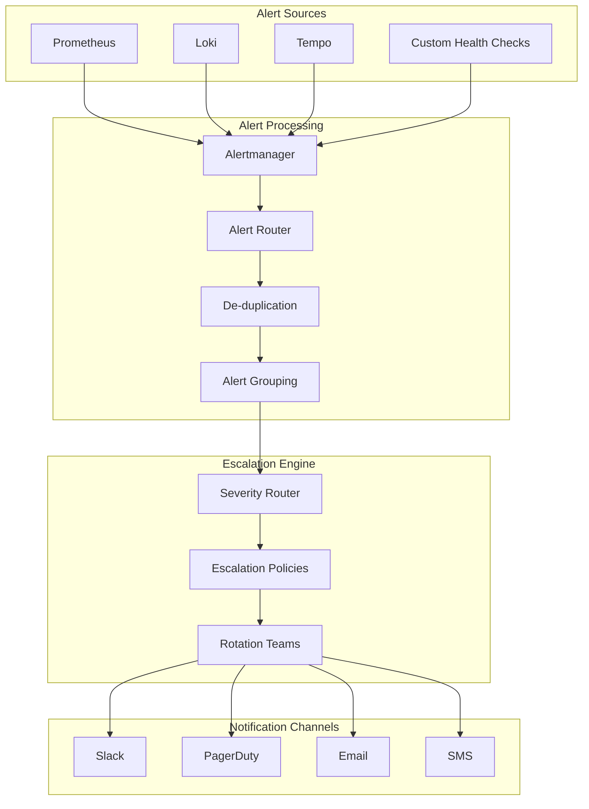

# Alerting System and Escalation Procedures

## 1. Overview

This document outlines the alerting system architecture and escalation procedures for the Phoenix Orchestrator system, providing a comprehensive framework for incident detection, notification, and response.

## 2. Architecture



## 3. Alert Definitions

### 3.1 System Health Alerts

```yaml
groups:
- name: system_health
  rules:
  - alert: HighCPUUsage
    expr: avg(rate(process_cpu_seconds_total[5m])) > 0.85
    for: 5m
    labels:
      severity: warning
      category: resource
      team: platform
    annotations:
      summary: High CPU usage detected
      description: "CPU usage is above 85% for 5 minutes"
      runbook_url: "docs/runbooks/high_cpu_usage.md"

  - alert: HighMemoryUsage
    expr: process_resident_memory_bytes / process_total_memory_bytes > 0.90
    for: 5m
    labels:
      severity: warning
      category: resource
      team: platform
    annotations:
      summary: High memory usage detected
      description: "Memory usage is above 90% for 5 minutes"
      runbook_url: "docs/runbooks/high_memory_usage.md"

  - alert: DiskSpaceCritical
    expr: disk_free_bytes / disk_total_bytes < 0.10
    for: 10m
    labels:
      severity: critical
      category: resource
      team: platform
    annotations:
      summary: Critical disk space
      description: "Less than 10% disk space remaining"
      runbook_url: "docs/runbooks/disk_space_critical.md"
```

### 3.2 Application Alerts

```yaml
groups:
- name: application_health
  rules:
  - alert: HighErrorRate
    expr: sum(rate(http_requests_total{status=~"5.."}[5m])) / sum(rate(http_requests_total[5m])) > 0.05
    for: 5m
    labels:
      severity: critical
      category: application
      team: backend
    annotations:
      summary: High error rate detected
      description: "Error rate is above 5% for 5 minutes"
      runbook_url: "docs/runbooks/high_error_rate.md"

  - alert: HighLatency
    expr: histogram_quantile(0.95, rate(request_duration_seconds_bucket[5m])) > 1
    for: 5m
    labels:
      severity: warning
      category: performance
      team: backend
    annotations:
      summary: High latency detected
      description: "95th percentile latency is above 1s"
      runbook_url: "docs/runbooks/high_latency.md"

  - alert: AgentUnhealthy
    expr: agent_health_score < 0.8
    for: 5m
    labels:
      severity: critical
      category: agents
      team: backend
    annotations:
      summary: Agent health degraded
      description: "Agent health score is below 80%"
      runbook_url: "docs/runbooks/agent_unhealthy.md"
```

## 4. Severity Levels

### 4.1 Severity Definitions

```rust
#[derive(Debug, Clone, PartialEq)]
pub enum AlertSeverity {
    Critical {
        response_time_minutes: u32,
        escalation_interval: u32,
        auto_resolution: bool,
    },
    Warning {
        response_time_minutes: u32,
        escalation_interval: u32,
        auto_resolution: bool,
    },
    Info {
        notification_channel: String,
        auto_resolution: bool,
    },
}

pub const SEVERITY_LEVELS: &[(&str, AlertSeverity)] = &[
    ("critical", AlertSeverity::Critical {
        response_time_minutes: 15,
        escalation_interval: 30,
        auto_resolution: false,
    }),
    ("warning", AlertSeverity::Warning {
        response_time_minutes: 30,
        escalation_interval: 60,
        auto_resolution: true,
    }),
    ("info", AlertSeverity::Info {
        notification_channel: "slack",
        auto_resolution: true,
    }),
];
```

### 4.2 Severity Matrix

| Severity | Response Time | Escalation Interval | Channels | Auto-Resolution |
|----------|--------------|---------------------|-----------|-----------------|
| Critical | 15 minutes   | 30 minutes         | PagerDuty, SMS, Slack | No |
| Warning  | 30 minutes   | 60 minutes         | PagerDuty, Slack | Yes |
| Info     | Best effort  | N/A                | Slack | Yes |

## 5. Escalation Paths

### 5.1 Escalation Policies

```yaml
escalation_policies:
  critical:
    - level: 1
      responders:
        - type: team
          name: primary_oncall
      timeout_minutes: 15
      
    - level: 2
      responders:
        - type: team
          name: secondary_oncall
      timeout_minutes: 15
      
    - level: 3
      responders:
        - type: team
          name: engineering_managers
      timeout_minutes: 30

  warning:
    - level: 1
      responders:
        - type: team
          name: primary_oncall
      timeout_minutes: 30
      
    - level: 2
      responders:
        - type: team
          name: secondary_oncall
      timeout_minutes: 60
```

### 5.2 On-Call Rotation

```yaml
oncall_rotations:
  primary_oncall:
    shift_length_hours: 12
    handoff_time: "08:00"
    timezone: "America/Chicago"
    members:
      - team: platform
        weight: 2
      - team: backend
        weight: 2
      - team: frontend
        weight: 1

  secondary_oncall:
    shift_length_hours: 24
    handoff_time: "09:00"
    timezone: "America/Chicago"
    members:
      - team: platform
        weight: 1
      - team: backend
        weight: 1
      - team: frontend
        weight: 1
```

## 6. Notification Configuration

### 6.1 PagerDuty Integration

```yaml
pagerduty:
  service_key: "${PAGERDUTY_SERVICE_KEY}"
  api_token: "${PAGERDUTY_API_TOKEN}"
  
  escalation_policies:
    default:
      id: "${PD_DEFAULT_ESCALATION_POLICY}"
    critical:
      id: "${PD_CRITICAL_ESCALATION_POLICY}"
    
  services:
    platform:
      name: "Platform Alerts"
      id: "${PD_PLATFORM_SERVICE_ID}"
    backend:
      name: "Backend Alerts"
      id: "${PD_BACKEND_SERVICE_ID}"
```

### 6.2 Slack Integration

```yaml
slack:
  webhook_url: "${SLACK_WEBHOOK_URL}"
  default_channel: "#alerts"
  
  channels:
    critical: "#alerts-critical"
    warning: "#alerts-warning"
    info: "#alerts-info"
    
  mentions:
    critical: "<!here>"
    warning: ""
    info: ""
```

## 7. Alert Routing Rules

```yaml
route:
  receiver: default
  group_by: ['alertname', 'category', 'team']
  group_wait: 30s
  group_interval: 5m
  repeat_interval: 4h

  routes:
    - match:
        severity: critical
      receiver: pagerduty-critical
      group_wait: 0s
      repeat_interval: 30m

    - match:
        severity: warning
      receiver: pagerduty-warning
      group_wait: 30s
      repeat_interval: 2h

    - match:
        severity: info
      receiver: slack-info
      group_wait: 1m
      repeat_interval: 6h
```

## 8. Incident Response

### 8.1 Automated Response Actions

```rust
pub struct AutomatedResponse {
    pub alert: Alert,
    pub actions: Vec<ResponseAction>,
    pub max_attempts: u32,
}

pub enum ResponseAction {
    RestartService {
        service_name: String,
        grace_period: Duration,
    },
    ScaleUp {
        service_name: String,
        increment: u32,
        max_replicas: u32,
    },
    EnableCircuitBreaker {
        service_name: String,
        duration: Duration,
    },
    ExecuteRunbook {
        runbook_id: String,
        params: HashMap<String, String>,
    },
}
```

### 8.2 Incident Management

```rust
pub struct Incident {
    pub id: String,
    pub alert: Alert,
    pub severity: AlertSeverity,
    pub status: IncidentStatus,
    pub created_at: DateTime<Utc>,
    pub updated_at: DateTime<Utc>,
    pub assigned_to: Option<String>,
    pub actions_taken: Vec<ResponseAction>,
    pub timeline: Vec<IncidentEvent>,
}

pub enum IncidentStatus {
    New,
    Acknowledged,
    Investigating,
    Mitigated,
    Resolved,
}
```

## 9. Implementation Plan

1. **Phase 1: Alert Definition**
   - Configure Prometheus alert rules
   - Set up Alertmanager
   - Define severity levels
   - Create initial runbooks

2. **Phase 2: Notification System**
   - Configure PagerDuty integration
   - Set up Slack integration
   - Implement email notifications
   - Test notification delivery

3. **Phase 3: Escalation System**
   - Configure escalation policies
   - Set up on-call rotations
   - Implement automated escalation
   - Test escalation paths

4. **Phase 4: Response Automation**
   - Implement automated responses
   - Create incident management system
   - Set up runbook automation
   - Test response procedures

## 10. Testing Strategy

1. **Alert Testing**
   - Verify alert triggering
   - Test alert grouping
   - Validate de-duplication
   - Check notification delivery

2. **Escalation Testing**
   - Test escalation timing
   - Verify on-call handoffs
   - Validate notification channels
   - Check response tracking

3. **Load Testing**
   - Test alert storm handling
   - Verify grouping under load
   - Validate rate limiting
   - Check system performance