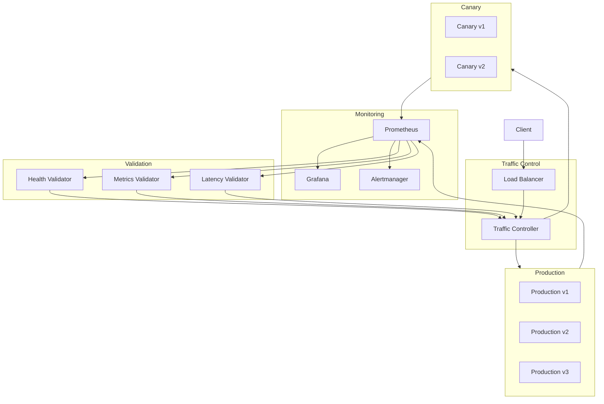

# Canary Deployment Architecture

## 1. Overview

This document outlines the canary deployment strategy for the Phoenix Orchestrator system, including progressive rollout, health validation, and automated rollback procedures.

## 2. Architecture



## 3. Progressive Rollout Strategy

### 3.1 Traffic Distribution Phases

1. **Phase 0: Pre-deployment** (0% traffic)
   - Deploy canary version
   - Verify basic health checks
   - Warm-up period (2 minutes)

2. **Phase 1: Initial Canary** (5% traffic)
   - Duration: 10 minutes
   - Strict monitoring of error rates
   - Latency comparison with baseline

3. **Phase 2: Expanded Canary** (20% traffic)
   - Duration: 15 minutes
   - Full metrics validation
   - Performance analysis

4. **Phase 3: Full Rollout** (100% traffic)
   - Progressive shift in 20% increments
   - 5-minute intervals between increases
   - Continuous validation

### 3.2 Traffic Control Configuration

```yaml
trafficControl:
  phases:
    - name: initial_canary
      percentage: 5
      duration: 600  # 10 minutes
      errorThreshold: 0.1%
      latencyThreshold: 100ms
    
    - name: expanded_canary
      percentage: 20
      duration: 900  # 15 minutes
      errorThreshold: 0.5%
      latencyThreshold: 200ms
    
    - name: full_rollout
      incrementSize: 20
      intervalSeconds: 300  # 5 minutes
      maxErrorRate: 1%
```

## 4. Health Check Metrics

### 4.1 Core Health Metrics

```rust
pub struct CanaryHealthMetrics {
    // Request metrics
    pub error_rate: Gauge,
    pub success_rate: Gauge,
    pub request_rate: Gauge,
    
    // Performance metrics
    pub p95_latency: Histogram,
    pub p99_latency: Histogram,
    pub cpu_usage: Gauge,
    pub memory_usage: Gauge,
    
    // Business metrics
    pub task_success_rate: Gauge,
    pub cache_hit_rate: Gauge,
    pub agent_health_score: Gauge,
}
```

### 4.2 Validation Thresholds

```yaml
validation:
  error_rate:
    warning: 0.5%
    critical: 1%
    
  latency:
    p95_threshold: 200ms
    p99_threshold: 500ms
    
  resource_usage:
    cpu_threshold: 80%
    memory_threshold: 85%
    
  business_metrics:
    min_task_success_rate: 99%
    min_cache_hit_rate: 90%
    min_agent_health: 95%
```

## 5. Automated Validation

### 5.1 Health Validator

```rust
pub struct HealthValidator {
    pub metrics_client: PrometheusClient,
    pub thresholds: ValidationThresholds,
}

impl HealthValidator {
    pub async fn validate_canary(&self) -> ValidationResult {
        let error_rate = self.metrics_client
            .query("rate(http_requests_total{status=~'5..'}[5m]) / rate(http_requests_total[5m])");
            
        let latency = self.metrics_client
            .query("histogram_quantile(0.95, rate(request_duration_seconds_bucket[5m]))");
            
        // Validate against thresholds
        let results = vec![
            self.validate_error_rate(error_rate),
            self.validate_latency(latency),
            self.validate_resource_usage(),
            self.validate_business_metrics(),
        ];
        
        ValidationResult::from_checks(results)
    }
}
```

### 5.2 Validation Rules

1. **Error Rate Validation**
   - Compare error rates between canary and baseline
   - Alert if canary error rate exceeds baseline by >0.1%
   - Trigger rollback if error rate >1%

2. **Latency Validation**
   - Monitor p95 and p99 latency
   - Compare with baseline measurements
   - Alert if latency increases by >20%

3. **Resource Usage Validation**
   - Monitor CPU and memory usage
   - Compare with baseline patterns
   - Alert on significant deviations

4. **Business Metrics Validation**
   - Task completion rates
   - Cache hit rates
   - Agent health scores
   - Custom business KPIs

## 6. Rollback Triggers

### 6.1 Automatic Rollback Conditions

```yaml
rollback_triggers:
  - condition: error_rate > 1%
    window: 5m
    action: immediate_rollback
    
  - condition: p95_latency > 500ms
    window: 5m
    action: immediate_rollback
    
  - condition: task_success_rate < 98%
    window: 10m
    action: gradual_rollback
    
  - condition: agent_health_score < 90%
    window: 5m
    action: gradual_rollback
```

### 6.2 Rollback Procedures

1. **Immediate Rollback**
   - Instantly redirect all traffic to stable version
   - Terminate canary instances
   - Alert operations team

2. **Gradual Rollback**
   - Gradually shift traffic back to stable version
   - 20% decrease every minute
   - Maintain monitoring and validation

## 7. Implementation Plan

1. **Phase 1: Infrastructure Setup**
   - Deploy traffic control system
   - Configure monitoring for canary metrics
   - Set up validation pipelines

2. **Phase 2: Validation System**
   - Implement health validators
   - Configure automated checks
   - Set up alerting rules

3. **Phase 3: Rollback Automation**
   - Implement rollback triggers
   - Test automated procedures
   - Verify recovery times

4. **Phase 4: Integration**
   - Connect with CI/CD pipeline
   - Configure deployment automation
   - Set up logging and auditing

## 8. Testing Strategy

1. **Chaos Testing**
   - Simulate partial outages
   - Test network latency impacts
   - Verify recovery procedures

2. **Load Testing**
   - Verify behavior under load
   - Test traffic shifting
   - Validate performance metrics

3. **Failure Injection**
   - Test rollback triggers
   - Verify alert generation
   - Validate recovery times