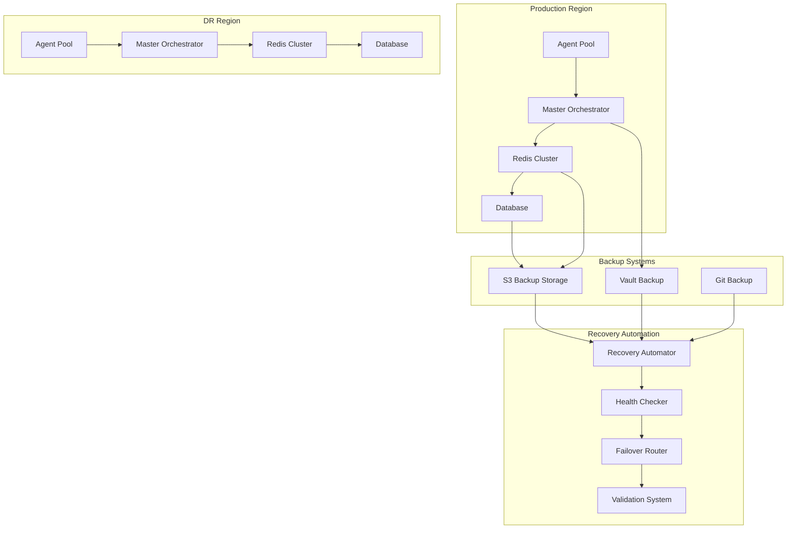

# Disaster Recovery and Backup Procedures

## 1. Overview

This document outlines the comprehensive disaster recovery (DR) and backup procedures for the Phoenix Orchestrator system, ensuring business continuity and data integrity during various failure scenarios.

## 2. Architecture



## 3. Backup Procedures

### 3.1 Data Classification

```rust
#[derive(Debug, Clone, Serialize)]
pub enum DataTier {
    Critical {
        backup_interval_minutes: u32,
        retention_days: u32,
        encryption_required: bool,
    },
    Important {
        backup_interval_minutes: u32,
        retention_days: u32,
        encryption_required: bool,
    },
    Standard {
        backup_interval_minutes: u32,
        retention_days: u32,
        encryption_required: bool,
    },
}

pub const DATA_TIERS: &[(&str, DataTier)] = &[
    ("redis_data", DataTier::Critical {
        backup_interval_minutes: 15,
        retention_days: 30,
        encryption_required: true,
    }),
    ("agent_state", DataTier::Important {
        backup_interval_minutes: 30,
        retention_days: 14,
        encryption_required: true,
    }),
    ("metrics", DataTier::Standard {
        backup_interval_minutes: 60,
        retention_days: 7,
        encryption_required: false,
    }),
];
```

### 3.2 Backup Configuration

```yaml
backup:
  s3:
    bucket: phoenix-orch-backups
    region: us-west-2
    encryption: AES256
    lifecycle_rules:
      - prefix: redis/
        expiration_days: 30
      - prefix: agent-state/
        expiration_days: 14
      - prefix: metrics/
        expiration_days: 7

  redis:
    backup_script: /usr/local/bin/redis-backup.sh
    schedule: "*/15 * * * *"  # Every 15 minutes
    retention:
      keep_last: 96  # Last 24 hours (15-minute intervals)
      keep_daily: 30
      keep_weekly: 8
      keep_monthly: 3

  vault:
    backup_path: /vault/backup
    schedule: "0 */1 * * *"  # Every hour
    retention:
      keep_last: 24  # Last 24 hours
      keep_daily: 7
      keep_weekly: 4

  git:
    repositories:
      - name: phoenix-orchestrator
        url: git@github.com:company/phoenix-orchestrator.git
        branch: main
        backup_schedule: "0 */6 * * *"  # Every 6 hours
```

## 4. Recovery Procedures

### 4.1 Recovery Time Objectives (RTO)

```yaml
rto_targets:
  critical_services:
    target_minutes: 15
    acceptable_minutes: 30
    
  important_services:
    target_minutes: 30
    acceptable_minutes: 60
    
  standard_services:
    target_minutes: 60
    acceptable_minutes: 120
```

### 4.2 Recovery Point Objectives (RPO)

```yaml
rpo_targets:
  redis_data:
    target_minutes: 15
    acceptable_minutes: 30
    
  agent_state:
    target_minutes: 30
    acceptable_minutes: 60
    
  metrics:
    target_minutes: 60
    acceptable_minutes: 120
```

### 4.3 Recovery Validation

```rust
pub struct RecoveryValidator {
    pub checks: Vec<ValidationCheck>,
    pub thresholds: ValidationThresholds,
}

impl RecoveryValidator {
    pub async fn validate_recovery(&self) -> ValidationResult {
        let mut results = Vec::new();
        
        // Data integrity checks
        results.push(self.validate_data_integrity().await);
        
        // Service health checks
        results.push(self.validate_service_health().await);
        
        // Performance checks
        results.push(self.validate_performance().await);
        
        // Consistency checks
        results.push(self.validate_consistency().await);
        
        ValidationResult::from_checks(results)
    }
}
```

## 5. Failover Procedures

### 5.1 Automated Failover

```rust
pub struct FailoverManager {
    pub config: FailoverConfig,
    pub health_checker: HealthChecker,
    pub dns_manager: DnsManager,
    pub recovery_validator: RecoveryValidator,
}

impl FailoverManager {
    pub async fn execute_failover(&self) -> Result<FailoverResult, FailoverError> {
        // 1. Verify DR region health
        self.health_checker.verify_dr_health().await?;
        
        // 2. Prepare DR region
        self.prepare_dr_region().await?;
        
        // 3. Switch DNS
        self.dns_manager.update_dns_records().await?;
        
        // 4. Validate failover
        self.recovery_validator.validate_recovery().await?;
        
        // 5. Update status
        self.update_failover_status().await?;
        
        Ok(FailoverResult::Success)
    }
}
```

### 5.2 DNS Failover Configuration

```yaml
dns_failover:
  provider: route53
  health_check:
    protocol: HTTPS
    port: 443
    path: /health
    interval: 10
    failure_threshold: 3
    
  primary_region:
    domain: phoenix-orch.example.com
    health_check_id: primary-hc-id
    
  dr_region:
    domain: dr.phoenix-orch.example.com
    health_check_id: dr-hc-id
    
  failover_policy:
    type: active-passive
    ttl: 60
```

## 6. Data Consistency Checks

### 6.1 Consistency Validation

```rust
pub struct ConsistencyValidator {
    pub checks: Vec<ConsistencyCheck>,
}

impl ConsistencyValidator {
    pub async fn validate_consistency(&self) -> ConsistencyResult {
        let mut results = Vec::new();
        
        // Redis data consistency
        results.push(self.validate_redis_consistency().await);
        
        // Agent state consistency
        results.push(self.validate_agent_state().await);
        
        // Configuration consistency
        results.push(self.validate_config_consistency().await);
        
        ConsistencyResult::from_checks(results)
    }
}
```

### 6.2 Data Integrity Checks

```yaml
integrity_checks:
  redis:
    - type: checksum
      interval: 15m
      action: alert_on_mismatch
      
    - type: record_count
      interval: 5m
      action: alert_on_threshold
      threshold: 5%
      
  agent_state:
    - type: state_hash
      interval: 5m
      action: alert_on_mismatch
      
    - type: version_check
      interval: 1m
      action: block_on_mismatch
```

## 7. Automated Recovery Procedures

### 7.1 Recovery Automation

```rust
pub struct RecoveryAutomation {
    pub config: RecoveryConfig,
    pub steps: Vec<RecoveryStep>,
}

impl RecoveryAutomation {
    pub async fn execute_recovery(&self) -> Result<RecoveryResult, RecoveryError> {
        // 1. Validate backup integrity
        self.validate_backups().await?;
        
        // 2. Restore data
        self.restore_data().await?;
        
        // 3. Verify data consistency
        self.verify_consistency().await?;
        
        // 4. Start services
        self.start_services().await?;
        
        // 5. Validate recovery
        self.validate_recovery().await?;
        
        Ok(RecoveryResult::Success)
    }
}
```

### 7.2 Recovery Steps

```yaml
recovery_steps:
  - name: backup_validation
    timeout: 5m
    retries: 3
    
  - name: data_restoration
    timeout: 30m
    retries: 2
    
  - name: consistency_check
    timeout: 10m
    retries: 3
    
  - name: service_startup
    timeout: 15m
    retries: 2
    
  - name: recovery_validation
    timeout: 10m
    retries: 3
```

## 8. Implementation Plan

1. **Phase 1: Backup Infrastructure**
   - Set up S3 backup storage
   - Configure backup schedules
   - Implement encryption
   - Test backup procedures

2. **Phase 2: Recovery Automation**
   - Implement recovery scripts
   - Set up validation checks
   - Configure automated recovery
   - Test recovery procedures

3. **Phase 3: Failover System**
   - Configure DNS failover
   - Set up health checks
   - Implement failover automation
   - Test failover procedures

4. **Phase 4: Monitoring Integration**
   - Configure recovery metrics
   - Set up alerting
   - Implement dashboards
   - Test monitoring system

## 9. Testing Strategy

### 9.1 Regular Testing Schedule

```yaml
testing_schedule:
  backup_verification:
    frequency: daily
    type: automated
    
  recovery_testing:
    frequency: weekly
    type: automated
    
  failover_testing:
    frequency: monthly
    type: manual
    
  full_dr_test:
    frequency: quarterly
    type: manual
```

### 9.2 Test Scenarios

1. **Backup Testing**
   - Verify backup completion
   - Validate backup integrity
   - Test restoration process
   - Verify data consistency

2. **Recovery Testing**
   - Test automated recovery
   - Verify service health
   - Validate data integrity
   - Check performance metrics

3. **Failover Testing**
   - Test DNS failover
   - Verify DR region
   - Validate failback
   - Check data consistency