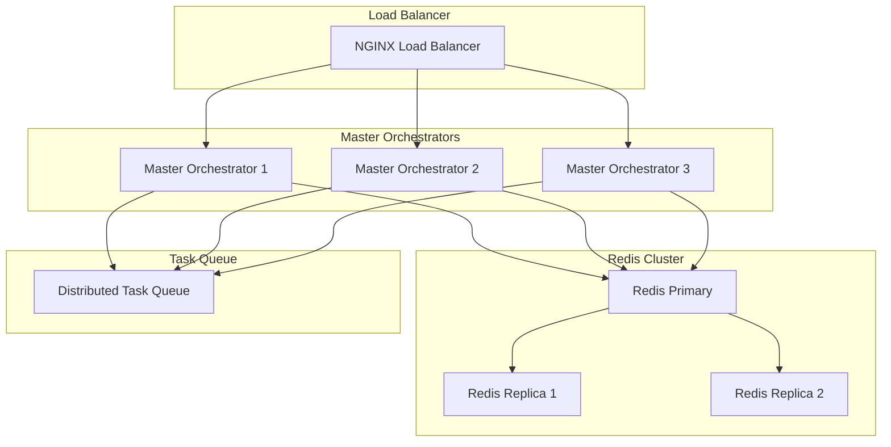

# Distributed Master Orchestrator Design

## 1. Overview

This document details the changes required to make the master_orchestrator work in a distributed environment, focusing on state synchronization, leader election, and distributed task processing.

## 2. Architecture Changes



## 3. State Management

### 3.1 Distributed State Interface
```rust
pub trait DistributedState {
    async fn get_state(&self, key: &str) -> Result<Option<String>, StateError>;
    async fn set_state(&self, key: &str, value: &str) -> Result<(), StateError>;
    async fn delete_state(&self, key: &str) -> Result<(), StateError>;
    async fn atomic_increment(&self, key: &str) -> Result<i64, StateError>;
}

pub struct RedisStateManager {
    redis_pool: RedisPool,
}

impl DistributedState for RedisStateManager {
    async fn get_state(&self, key: &str) -> Result<Option<String>, StateError> {
        let mut conn = self.redis_pool.get().await?;
        conn.get(key).await
    }

    async fn set_state(&self, key: &str, value: &str) -> Result<(), StateError> {
        let mut conn = self.redis_pool.get().await?;
        conn.set(key, value).await
    }
}
```

### 3.2 Session Management
```rust
pub struct DistributedSession {
    pub session_id: String,
    pub correlation_id: String,
    pub created_at: DateTime<Utc>,
    pub last_accessed: DateTime<Utc>,
    pub data: HashMap<String, String>,
}

impl DistributedSession {
    pub async fn save(&self, state: &impl DistributedState) -> Result<(), SessionError> {
        let key = format!("session:{}", self.session_id);
        state.set_state(&key, &serde_json::to_string(self)?).await?;
        Ok(())
    }

    pub async fn load(
        state: &impl DistributedState,
        session_id: &str,
    ) -> Result<Option<Self>, SessionError> {
        let key = format!("session:{}", session_id);
        if let Some(data) = state.get_state(&key).await? {
            Ok(Some(serde_json::from_str(&data)?))
        } else {
            Ok(None)
        }
    }
}
```

## 4. Task Distribution

### 4.1 Distributed Task Queue
```rust
pub struct DistributedTaskQueue {
    redis: RedisPool,
}

impl DistributedTaskQueue {
    pub async fn enqueue_task(&self, task: Task) -> Result<(), QueueError> {
        let mut conn = self.redis.get().await?;
        let task_json = serde_json::to_string(&task)?;
        conn.lpush("tasks:queue", task_json).await?;
        Ok(())
    }

    pub async fn dequeue_task(&self) -> Result<Option<Task>, QueueError> {
        let mut conn = self.redis.get().await?;
        if let Some(task_json) = conn.rpop("tasks:queue").await? {
            Ok(Some(serde_json::from_str(&task_json)?))
        } else {
            Ok(None)
        }
    }
}
```

### 4.2 Task Processing
```rust
pub struct TaskProcessor {
    queue: Arc<DistributedTaskQueue>,
    state: Arc<RedisStateManager>,
}

impl TaskProcessor {
    pub async fn process_tasks(&self) -> Result<(), ProcessError> {
        loop {
            if let Some(task) = self.queue.dequeue_task().await? {
                let task_id = task.id.clone();
                let processing_key = format!("task:processing:{}", task_id);
                
                // Atomic task claim
                if self.state.set_nx(&processing_key, "1").await? {
                    tokio::spawn(async move {
                        if let Err(e) = self.process_single_task(task).await {
                            error!("Task processing failed: {}", e);
                        }
                        self.state.delete(&processing_key).await?;
                    });
                }
            }
        }
    }
}
```

## 5. Leader Election

### 5.1 Leader Election Implementation
```rust
pub struct LeaderElection {
    redis: RedisPool,
    node_id: String,
    ttl: Duration,
}

impl LeaderElection {
    pub async fn try_become_leader(&self) -> Result<bool, ElectionError> {
        let mut conn = self.redis.get().await?;
        
        // Try to acquire leadership with TTL
        let result: bool = conn
            .set_nx_ex(
                "leader:master_orchestrator",
                &self.node_id,
                self.ttl.as_secs() as usize,
            )
            .await?;
            
        Ok(result)
    }

    pub async fn renew_leadership(&self) -> Result<bool, ElectionError> {
        let mut conn = self.redis.get().await?;
        
        // Extend leadership TTL if we're still the leader
        let result: bool = conn
            .eval(
                r#"
                if redis.call('get', KEYS[1]) == ARGV[1] then
                    return redis.call('expire', KEYS[1], ARGV[2])
                end
                return 0
                "#,
                &["leader:master_orchestrator"],
                &[&self.node_id, &self.ttl.as_secs().to_string()],
            )
            .await?;
            
        Ok(result)
    }
}
```

### 5.2 Leadership Tasks
```rust
pub struct LeaderTasks {
    election: LeaderElection,
    state: RedisStateManager,
}

impl LeaderTasks {
    pub async fn run_leader_tasks(&self) {
        loop {
            if self.election.try_become_leader().await? {
                info!("Became leader, starting leader tasks");
                
                loop {
                    if !self.election.renew_leadership().await? {
                        warn!("Lost leadership, stopping leader tasks");
                        break;
                    }
                    
                    self.cleanup_stale_tasks().await?;
                    self.rebalance_workload().await?;
                    
                    tokio::time::sleep(Duration::from_secs(5)).await;
                }
            }
            
            tokio::time::sleep(Duration::from_secs(1)).await;
        }
    }
}
```

## 6. Distributed Locking

### 6.1 Lock Implementation
```rust
pub struct DistributedLock {
    redis: RedisPool,
    lock_key: String,
    owner_id: String,
    ttl: Duration,
}

impl DistributedLock {
    pub async fn acquire(&self) -> Result<bool, LockError> {
        let mut conn = self.redis.get().await?;
        
        let result: bool = conn
            .set_nx_ex(
                &self.lock_key,
                &self.owner_id,
                self.ttl.as_secs() as usize,
            )
            .await?;
            
        Ok(result)
    }

    pub async fn release(&self) -> Result<bool, LockError> {
        let mut conn = self.redis.get().await?;
        
        let result: bool = conn
            .eval(
                r#"
                if redis.call('get', KEYS[1]) == ARGV[1] then
                    return redis.call('del', KEYS[1])
                end
                return 0
                "#,
                &[&self.lock_key],
                &[&self.owner_id],
            )
            .await?;
            
        Ok(result)
    }
}
```

## 7. Health Checks

### 7.1 Node Health Check
```rust
pub struct HealthCheck {
    node_id: String,
    state: RedisStateManager,
}

impl HealthCheck {
    pub async fn update_health(&self) -> Result<(), HealthError> {
        let health_key = format!("health:{}", self.node_id);
        let health = json!({
            "node_id": self.node_id,
            "timestamp": Utc::now(),
            "status": "healthy",
            "load": get_system_load()?,
        });
        
        self.state.set_ex(
            &health_key,
            &health.to_string(),
            30,  // 30 second TTL
        ).await?;
        
        Ok(())
    }
}
```

## 8. Configuration Management

### 8.1 Distributed Configuration
```rust
pub struct DistributedConfig {
    state: RedisStateManager,
}

impl DistributedConfig {
    pub async fn get_config(&self) -> Result<AppConfig, ConfigError> {
        if let Some(config_str) = self.state.get_state("config:current").await? {
            Ok(serde_json::from_str(&config_str)?)
        } else {
            Ok(AppConfig::default())
        }
    }

    pub async fn update_config(&self, config: &AppConfig) -> Result<(), ConfigError> {
        self.state
            .set_state("config:current", &serde_json::to_string(config)?)
            .await?;
        Ok(())
    }
}
```

## 9. Error Handling

### 9.1 Distributed Error Types
```rust
#[derive(Debug, Error)]
pub enum DistributedError {
    #[error("State error: {0}")]
    StateError(#[from] StateError),
    
    #[error("Queue error: {0}")]
    QueueError(#[from] QueueError),
    
    #[error("Lock error: {0}")]
    LockError(#[from] LockError),
    
    #[error("Election error: {0}")]
    ElectionError(#[from] ElectionError),
    
    #[error("Session error: {0}")]
    SessionError(#[from] SessionError),
}
```

## 10. Implementation Plan

1. Add Redis connection pool and state management
2. Implement distributed task queue
3. Add leader election mechanism
4. Implement distributed locking
5. Add health check system
6. Update configuration management
7. Add error handling
8. Test distributed operations

## 11. Testing Strategy

### 11.1 Unit Tests
- Test state management operations
- Verify task queue functionality
- Test leader election process
- Validate locking mechanisms

### 11.2 Integration Tests
- Test multi-node operations
- Verify state synchronization
- Test failover scenarios
- Validate distributed configuration

### 11.3 Load Tests
- Test concurrent task processing
- Verify state consistency under load
- Test leader election under network partitions
- Validate system recovery