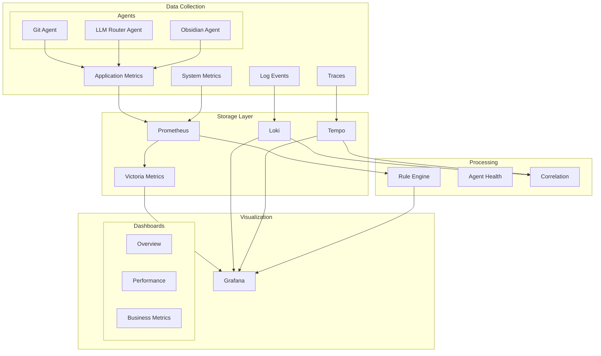

# Enhanced Monitoring and Observability Infrastructure

## 1. Overview

This document outlines the enhanced monitoring and observability infrastructure for the Phoenix Orchestrator system, providing comprehensive coverage across metrics, logging, tracing, and performance monitoring.

## 2. Architecture



## 3. Metrics Collection

### 3.1 Application Metrics

```rust
pub struct EnhancedMetrics {
    // Request metrics
    pub requests_total: Counter,
    pub request_duration_seconds: Histogram,
    pub request_size_bytes: Histogram,
    pub response_size_bytes: Histogram,
    pub request_errors_total: Counter,
    
    // Task metrics
    pub tasks_queued_total: Counter,
    pub tasks_completed_total: Counter,
    pub tasks_failed_total: Counter,
    pub task_duration_seconds: Histogram,
    pub task_queue_time_seconds: Histogram,
    
    // Resource metrics
    pub memory_usage_bytes: Gauge,
    pub cpu_usage_percent: Gauge,
    pub goroutines_total: Gauge,
    pub open_connections: Gauge,
    pub file_descriptors: Gauge,
    
    // Cache metrics
    pub cache_hits_total: Counter,
    pub cache_misses_total: Counter,
    pub cache_size_bytes: Gauge,
    pub cache_items_total: Gauge,
    pub cache_evictions_total: Counter,
    
    // Agent metrics
    pub agent_calls_total: Counter,
    pub agent_errors_total: Counter,
    pub agent_duration_seconds: Histogram,
    pub agent_queue_depth: Gauge,
    
    // Business metrics
    pub plan_success_rate: Gauge,
    pub agent_health_score: Gauge,
    pub system_load_score: Gauge,
}
```

### 3.2 System Metrics

```yaml
node_exporter:
  enabled: true
  collectors:
    - cpu
    - diskstats
    - filesystem
    - loadavg
    - meminfo
    - netdev
    - netstat
    - stat
    - time
    - vmstat
    - systemd

  custom_collectors:
    - name: redis_stats
      command: /usr/local/bin/redis-stats.sh
      interval: 30s
      
    - name: agent_health
      command: /usr/local/bin/check-agents.sh
      interval: 60s
```

## 4. Log Aggregation

### 4.1 Log Format

```rust
#[derive(Debug, Serialize)]
pub struct EnhancedLogEntry {
    // Standard fields
    pub timestamp: DateTime<Utc>,
    pub level: String,
    pub correlation_id: Option<String>,
    pub plan_id: Option<String>,
    pub task_id: Option<String>,
    pub component: String,
    pub message: String,
    
    // Enhanced fields
    pub span_id: Option<String>,
    pub trace_id: Option<String>,
    pub user_id: Option<String>,
    pub request_id: Option<String>,
    pub environment: String,
    pub version: String,
    
    // Context fields
    pub metadata: HashMap<String, Value>,
    pub tags: Vec<String>,
    pub duration_ms: Option<u64>,
    pub caller: Option<String>,
}
```

### 4.2 Loki Configuration

```yaml
loki:
  config:
    ingester:
      chunk_idle_period: 30m
      chunk_retain_period: 15m
      lifecycler:
        ring:
          replication_factor: 3
          
    schema_config:
      configs:
        - from: "2025-01-01"
          index:
            period: 24h
            prefix: index_
          object_store: s3
          schema: v12
          store: boltdb-shipper
          
    storage_config:
      aws:
        s3: s3://logs-bucket/phoenix-orch
        region: us-west-2
      boltdb_shipper:
        active_index_directory: /loki/index
        cache_location: /loki/cache
        
    limits_config:
      retention_period: 90d
      max_query_length: 721h
```

## 5. Distributed Tracing

### 5.1 Trace Configuration

```rust
pub struct EnhancedTraceConfig {
    pub service_name: String,
    pub environment: String,
    pub version: String,
    pub sampling_ratio: f64,
    pub tempo_endpoint: String,
    
    // Enhanced settings
    pub max_attributes: usize,
    pub max_events: usize,
    pub max_links: usize,
    pub attribute_count_limit: usize,
}

pub struct EnhancedTracer {
    config: EnhancedTraceConfig,
    provider: TracerProvider,
}

impl EnhancedTracer {
    pub fn start_span(&self, name: &str, context: Option<Context>) -> Span {
        let mut span = self.provider
            .tracer("phoenix-orchestrator")
            .start(name);
            
        // Add standard attributes
        span.set_attribute("service.name", self.config.service_name.clone());
        span.set_attribute("environment", self.config.environment.clone());
        span.set_attribute("version", self.config.version.clone());
        
        // Add custom attributes
        if let Some(ctx) = context {
            span.set_attribute("correlation_id", ctx.correlation_id);
            span.set_attribute("request_id", ctx.request_id);
            span.set_attribute("user_id", ctx.user_id);
        }
        
        span
    }
}
```

### 5.2 Tempo Configuration

```yaml
tempo:
  retention: 336h  # 14 days
  backend: s3
  s3:
    bucket: traces-bucket
    endpoint: s3.amazonaws.com
    region: us-west-2
    
  ingester:
    max_block_duration: 30m
    
  distributor:
    receivers:
      jaeger:
        protocols:
          thrift_http:
            endpoint: 0.0.0.0:14268
      otlp:
        protocols:
          grpc:
            endpoint: 0.0.0.0:4317
          http:
            endpoint: 0.0.0.0:4318
            
  compactor:
    compaction:
      block_retention: 336h
      
  metrics_generator:
    registry:
      external_labels:
        source: tempo
        cluster: phoenix-orch
```

## 6. Performance Monitoring

### 6.1 Resource Metrics

```rust
pub struct ResourceMetrics {
    // CPU metrics
    pub cpu_usage_percent: Gauge,
    pub cpu_system_percent: Gauge,
    pub cpu_user_percent: Gauge,
    pub cpu_iowait_percent: Gauge,
    
    // Memory metrics
    pub memory_used_bytes: Gauge,
    pub memory_available_bytes: Gauge,
    pub memory_cached_bytes: Gauge,
    pub memory_swap_used_bytes: Gauge,
    
    // Disk metrics
    pub disk_usage_bytes: Gauge,
    pub disk_io_reads: Counter,
    pub disk_io_writes: Counter,
    pub disk_io_queue: Gauge,
    
    // Network metrics
    pub network_bytes_in: Counter,
    pub network_bytes_out: Counter,
    pub network_packets_in: Counter,
    pub network_packets_out: Counter,
    pub network_errors: Counter,
}
```

### 6.2 Performance Dashboards

1. **System Overview**
   ```json
   {
     "title": "System Performance",
     "panels": [
       {
         "title": "CPU Usage",
         "type": "graph",
         "targets": [
           {
             "expr": "rate(process_cpu_seconds_total[5m])"
           }
         ]
       },
       {
         "title": "Memory Usage",
         "type": "graph",
         "targets": [
           {
             "expr": "process_resident_memory_bytes"
           }
         ]
       },
       {
         "title": "Disk IO",
         "type": "graph",
         "targets": [
           {
             "expr": "rate(disk_io_reads[5m])"
           },
           {
             "expr": "rate(disk_io_writes[5m])"
           }
         ]
       }
     ]
   }
   ```

2. **Application Performance**
   ```json
   {
     "title": "Application Performance",
     "panels": [
       {
         "title": "Request Rate",
         "type": "graph",
         "targets": [
           {
             "expr": "rate(requests_total[5m])"
           }
         ]
       },
       {
         "title": "Error Rate",
         "type": "graph",
         "targets": [
           {
             "expr": "rate(request_errors_total[5m])"
           }
         ]
       },
       {
         "title": "Latency",
         "type": "heatmap",
         "targets": [
           {
             "expr": "rate(request_duration_seconds_bucket[5m])"
           }
         ]
       }
     ]
   }
   ```

## 7. Resource Utilization Tracking

### 7.1 Resource Quotas

```yaml
resource_quotas:
  cpu:
    limit: 32
    request: 16
    alert_threshold: 80%
    
  memory:
    limit: 64Gi
    request: 32Gi
    alert_threshold: 85%
    
  storage:
    limit: 500Gi
    request: 200Gi
    alert_threshold: 75%
```

### 7.2 Resource Monitoring

```rust
pub struct ResourceMonitor {
    metrics: ResourceMetrics,
    quotas: ResourceQuotas,
}

impl ResourceMonitor {
    pub async fn check_utilization(&self) -> Vec<ResourceAlert> {
        let mut alerts = Vec::new();
        
        // Check CPU utilization
        let cpu_usage = self.metrics.cpu_usage_percent.get();
        if cpu_usage > self.quotas.cpu.alert_threshold {
            alerts.push(ResourceAlert::new(
                "CPU",
                cpu_usage,
                self.quotas.cpu.alert_threshold,
            ));
        }
        
        // Check memory utilization
        let memory_usage = self.metrics.memory_used_bytes.get() as f64
            / self.quotas.memory.limit as f64;
        if memory_usage > self.quotas.memory.alert_threshold {
            alerts.push(ResourceAlert::new(
                "Memory",
                memory_usage,
                self.quotas.memory.alert_threshold,
            ));
        }
        
        alerts
    }
}
```

## 8. Implementation Plan

1. **Phase 1: Core Metrics**
   - Deploy Prometheus and Victoria Metrics
   - Implement enhanced metrics collection
   - Set up basic dashboards

2. **Phase 2: Logging Infrastructure**
   - Deploy Loki
   - Implement enhanced log format
   - Configure log shipping

3. **Phase 3: Tracing System**
   - Deploy Tempo
   - Implement distributed tracing
   - Configure trace sampling

4. **Phase 4: Performance Monitoring**
   - Set up resource monitoring
   - Configure performance dashboards
   - Implement resource alerts

## 9. Testing Strategy

1. **Load Testing**
   - Generate synthetic load
   - Verify metric collection
   - Validate dashboard accuracy

2. **Chaos Testing**
   - Simulate component failures
   - Verify monitoring resilience
   - Test alert generation

3. **Integration Testing**
   - Verify data correlation
   - Test query performance
   - Validate retention policies