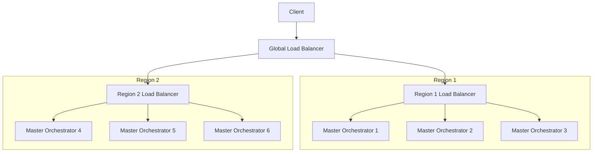
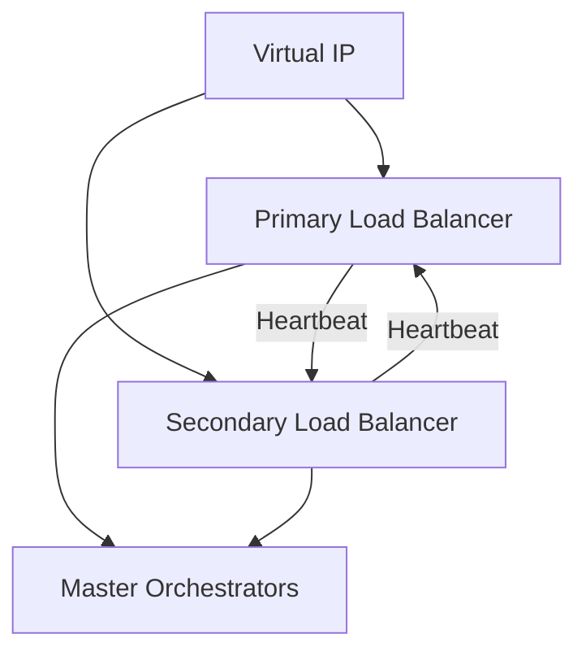

# Load Balancer Design

## 1. Overview

This document details the load balancer configuration for the Phoenix Orchestrator system, focusing on high availability, session affinity, and optimal request distribution across master_orchestrator instances.

## 2. Load Balancer Architecture



## 3. Load Balancer Configuration

### 3.1 Nginx Configuration
```nginx
# Main configuration
worker_processes auto;
worker_rlimit_nofile 65535;

events {
    worker_connections 16384;
    multi_accept on;
    use epoll;
}

http {
    # Basic settings
    sendfile on;
    tcp_nopush on;
    tcp_nodelay on;
    keepalive_timeout 65;
    types_hash_max_size 2048;
    server_tokens off;

    # SSL configuration
    ssl_protocols TLSv1.2 TLSv1.3;
    ssl_prefer_server_ciphers on;
    ssl_ciphers ECDHE-ECDSA-AES128-GCM-SHA256:ECDHE-RSA-AES128-GCM-SHA256;
    ssl_session_cache shared:SSL:10m;
    ssl_session_timeout 10m;

    # Upstream configuration
    upstream master_orchestrator {
        least_conn;  # Least connections distribution
        
        # Health check parameters
        check interval=3000 rise=2 fall=5 timeout=1000 type=http;
        check_http_send "HEAD /health HTTP/1.0\r\n\r\n";
        check_http_expect_alive http_2xx http_3xx;

        # Backend servers
        server master-orchestrator-0.master-orchestrator:8080 max_fails=3 fail_timeout=30s;
        server master-orchestrator-1.master-orchestrator:8080 max_fails=3 fail_timeout=30s;
        server master-orchestrator-2.master-orchestrator:8080 max_fails=3 fail_timeout=30s;

        # Session persistence
        sticky cookie SERVERID expires=1h domain=.phoenix-orch;
    }

    # Rate limiting settings
    limit_req_zone $binary_remote_addr zone=api_limit:10m rate=10r/s;
    limit_conn_zone $binary_remote_addr zone=addr_limit:10m;

    # Server configuration
    server {
        listen 80;
        listen [::]:80;
        server_name phoenix-orch.example.com;
        return 301 https://$server_name$request_uri;
    }

    server {
        listen 443 ssl http2;
        listen [::]:443 ssl http2;
        server_name phoenix-orch.example.com;

        # SSL certificate configuration
        ssl_certificate /etc/nginx/ssl/phoenix-orch.crt;
        ssl_certificate_key /etc/nginx/ssl/phoenix-orch.key;

        # Security headers
        add_header Strict-Transport-Security "max-age=31536000; includeSubDomains" always;
        add_header X-Frame-Options DENY;
        add_header X-Content-Type-Options nosniff;
        add_header X-XSS-Protection "1; mode=block";

        # Proxy settings
        location / {
            proxy_pass http://master_orchestrator;
            proxy_http_version 1.1;
            proxy_set_header Upgrade $http_upgrade;
            proxy_set_header Connection 'upgrade';
            proxy_set_header Host $host;
            proxy_cache_bypass $http_upgrade;
            proxy_set_header X-Real-IP $remote_addr;
            proxy_set_header X-Forwarded-For $proxy_add_x_forwarded_for;
            proxy_set_header X-Forwarded-Proto $scheme;

            # Rate limiting
            limit_req zone=api_limit burst=20 nodelay;
            limit_conn addr_limit 10;

            # Timeouts
            proxy_connect_timeout 60s;
            proxy_send_timeout 60s;
            proxy_read_timeout 60s;
        }

        # Health check endpoint
        location /health {
            proxy_pass http://master_orchestrator;
            proxy_http_version 1.1;
            proxy_set_header Host $host;
            
            access_log off;
            allow 127.0.0.1;
            deny all;
        }

        # Metrics endpoint
        location /metrics {
            proxy_pass http://master_orchestrator:9000;
            proxy_http_version 1.1;
            proxy_set_header Host $host;
            
            allow 127.0.0.1;
            deny all;
        }
    }
}
```

## 4. Load Balancing Strategies

### 4.1 Request Distribution
- Primary: Least Connections
- Backup: Round Robin
- Health check based failover
- Session persistence via cookies

### 4.2 Health Checks
- Interval: 3 seconds
- Timeout: 1 second
- Rise: 2 successful checks to mark as healthy
- Fall: 5 failed checks to mark as unhealthy
- Check endpoint: `/health`

### 4.3 Session Persistence
- Cookie-based sticky sessions
- Cookie name: SERVERID
- Expiration: 1 hour
- Fallback to least connections if cookie is missing

## 5. Security Measures

### 5.1 SSL/TLS Configuration
- TLS 1.2 and 1.3 only
- Strong cipher suites
- HSTS enabled
- SSL session caching

### 5.2 Rate Limiting
- 10 requests per second per IP
- Burst allowance: 20 requests
- Maximum 10 concurrent connections per IP

### 5.3 Security Headers
- HSTS
- X-Frame-Options
- X-Content-Type-Options
- X-XSS-Protection

## 6. High Availability Setup

### 6.1 Load Balancer Redundancy


### 6.2 Failover Configuration
```yaml
# Keepalived configuration
vrrp_instance VI_1 {
    state MASTER
    interface eth0
    virtual_router_id 51
    priority 100
    authentication {
        auth_type PASS
        auth_pass phoenix123
    }
    virtual_ipaddress {
        192.168.1.10
    }
}
```

## 7. Monitoring

### 7.1 Load Balancer Metrics
- Active connections
- Request rate
- Error rate
- Backend response time
- SSL handshake time
- Connection queue length

### 7.2 Prometheus Integration
```nginx
location /nginx_status {
    stub_status on;
    access_log off;
    allow 127.0.0.1;
    deny all;
}
```

### 7.3 Alert Rules
```yaml
groups:
- name: load_balancer_alerts
  rules:
  - alert: HighErrorRate
    expr: rate(nginx_http_requests_total{status=~"5.."}[5m]) > 0.05
    for: 5m
    labels:
      severity: critical
    annotations:
      description: "High error rate detected on load balancer"

  - alert: BackendDown
    expr: nginx_up{backend="master_orchestrator"} == 0
    for: 1m
    labels:
      severity: critical
    annotations:
      description: "Backend server is down"
```

## 8. Disaster Recovery

### 8.1 Backup Configuration
- Regular config backups
- SSL certificate backups
- Documentation of custom configurations
- Automated restore procedures

### 8.2 Recovery Procedures
1. Failover to secondary load balancer
2. Restore from configuration backup
3. Verify SSL certificates
4. Test backend connectivity
5. Validate session persistence
6. Monitor error rates

## 9. Performance Tuning

### 9.1 OS Tuning
```bash
# System limits
sysctl -w net.core.somaxconn=65535
sysctl -w net.ipv4.tcp_max_syn_backlog=65535
sysctl -w net.ipv4.tcp_fin_timeout=30
sysctl -w net.ipv4.tcp_keepalive_time=300
```

### 9.2 Worker Process Optimization
- Worker processes = CPU cores
- Worker connections = 16384
- Multi-accept enabled
- Epoll event model

## 10. Implementation Checklist

1. Deploy load balancer infrastructure
2. Configure SSL certificates
3. Set up health checks
4. Enable session persistence
5. Configure rate limiting
6. Set up monitoring
7. Test failover scenarios
8. Document recovery procedures