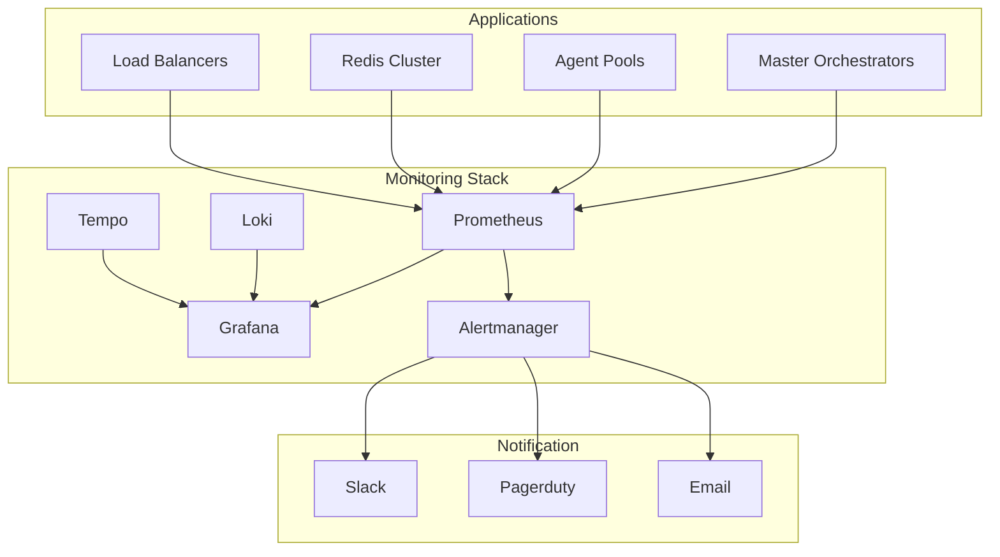

# Monitoring and Observability Plan

## 1. Overview

This document outlines the comprehensive monitoring and observability strategy for the Phoenix Orchestrator system, covering metrics, logging, tracing, and alerting across all components.

## 2. Metrics Architecture



## 3. Metric Collection

### 3.1 Master Orchestrator Metrics
```rust
pub struct OrchestratorMetrics {
    // Request metrics
    pub requests_total: Counter,
    pub request_duration_seconds: Histogram,
    pub request_size_bytes: Histogram,
    pub response_size_bytes: Histogram,
    
    // Task metrics
    pub tasks_queued_total: Counter,
    pub tasks_completed_total: Counter,
    pub tasks_failed_total: Counter,
    pub task_duration_seconds: Histogram,
    
    // Resource metrics
    pub memory_usage_bytes: Gauge,
    pub cpu_usage_percent: Gauge,
    pub goroutines_total: Gauge,
    pub open_connections: Gauge,
    
    // Cache metrics
    pub cache_hits_total: Counter,
    pub cache_misses_total: Counter,
    pub cache_size_bytes: Gauge,
}

impl OrchestratorMetrics {
    pub fn record_request(&self, duration: Duration, size: usize) {
        self.requests_total.inc();
        self.request_duration_seconds.observe(duration.as_secs_f64());
        self.request_size_bytes.observe(size as f64);
    }
}
```

### 3.2 Agent Metrics
```rust
pub struct AgentMetrics {
    // Operation metrics
    pub operations_total: Counter,
    pub operation_duration_seconds: Histogram,
    pub operation_failures_total: Counter,
    
    // Resource metrics
    pub memory_usage_bytes: Gauge,
    pub cpu_usage_percent: Gauge,
    pub threads_total: Gauge,
}
```

### 3.3 Redis Metrics
```yaml
# Prometheus Redis Exporter config
redis_exporter:
  include_metrics:
    - redis_connected_clients
    - redis_used_memory
    - redis_commands_total
    - redis_keyspace_hits_total
    - redis_keyspace_misses_total
    - redis_connected_replica_count
    - redis_master_repl_offset
    - redis_replication_lag
```

## 4. Logging Strategy

### 4.1 Log Format
```rust
#[derive(Debug, Serialize)]
pub struct LogEntry {
    pub timestamp: DateTime<Utc>,
    pub level: String,
    pub correlation_id: Option<String>,
    pub plan_id: Option<String>,
    pub task_id: Option<String>,
    pub component: String,
    pub message: String,
    pub metadata: HashMap<String, Value>,
}

impl LogEntry {
    pub fn new(level: &str, message: &str) -> Self {
        Self {
            timestamp: Utc::now(),
            level: level.to_string(),
            correlation_id: None,
            plan_id: None,
            task_id: None,
            component: env::var("COMPONENT_NAME").unwrap_or_default(),
            message: message.to_string(),
            metadata: HashMap::new(),
        }
    }
}
```

### 4.2 Log Aggregation (Loki)
```yaml
loki:
  config:
    ingester:
      chunk_idle_period: 1h
      chunk_retain_period: 30s
      lifecycler:
        ring:
          replication_factor: 3
    schema_config:
      configs:
        - from: "2025-01-01"
          index:
            period: 24h
            prefix: index_
          object_store: s3
          schema: v12
          store: boltdb-shipper
```

## 5. Distributed Tracing

### 5.1 Trace Configuration
```rust
pub struct TraceConfig {
    pub service_name: String,
    pub environment: String,
    pub sampling_ratio: f64,
    pub tempo_endpoint: String,
}

pub struct Tracer {
    config: TraceConfig,
    provider: TracerProvider,
}

impl Tracer {
    pub fn start_span(&self, name: &str) -> Span {
        let mut span = self.provider
            .tracer("phoenix-orchestrator")
            .start(name);
            
        span.set_attribute("service.name", self.config.service_name.clone());
        span.set_attribute("environment", self.config.environment.clone());
        
        span
    }
}
```

### 5.2 Trace Context Propagation
```rust
pub async fn propagate_context<T>(
    ctx: Context,
    carrier: &mut T,
) -> Result<(), PropagationError>
where
    T: TextMapCarrier,
{
    global::get_text_map_propagator(|propagator| {
        propagator.inject_context(&ctx, carrier);
    });
    Ok(())
}
```

## 6. Alerting Rules

### 6.1 System Alerts
```yaml
groups:
- name: system_alerts
  rules:
  - alert: HighCPUUsage
    expr: avg(rate(process_cpu_seconds_total[5m])) > 0.8
    for: 5m
    labels:
      severity: warning
    annotations:
      description: "High CPU usage detected"

  - alert: HighMemoryUsage
    expr: process_resident_memory_bytes / process_total_memory_bytes > 0.85
    for: 5m
    labels:
      severity: warning
    annotations:
      description: "High memory usage detected"

  - alert: HighLatency
    expr: histogram_quantile(0.95, rate(request_duration_seconds_bucket[5m])) > 1
    for: 5m
    labels:
      severity: warning
    annotations:
      description: "High request latency detected"
```

### 6.2 Business Alerts
```yaml
groups:
- name: business_alerts
  rules:
  - alert: HighErrorRate
    expr: sum(rate(task_failures_total[5m])) / sum(rate(tasks_total[5m])) > 0.05
    for: 5m
    labels:
      severity: critical
    annotations:
      description: "High task failure rate detected"

  - alert: AgentUnhealthy
    expr: agent_health_status{health="unhealthy"} > 0
    for: 5m
    labels:
      severity: critical
    annotations:
      description: "Agent reported as unhealthy"
```

## 7. Dashboards

### 7.1 System Overview Dashboard
```json
{
  "title": "System Overview",
  "panels": [
    {
      "title": "CPU Usage",
      "type": "graph",
      "targets": [
        {
          "expr": "rate(process_cpu_seconds_total[5m])"
        }
      ]
    },
    {
      "title": "Memory Usage",
      "type": "graph",
      "targets": [
        {
          "expr": "process_resident_memory_bytes"
        }
      ]
    },
    {
      "title": "Request Rate",
      "type": "graph",
      "targets": [
        {
          "expr": "rate(requests_total[5m])"
        }
      ]
    }
  ]
}
```

### 7.2 Business Metrics Dashboard
```json
{
  "title": "Business Metrics",
  "panels": [
    {
      "title": "Task Success Rate",
      "type": "gauge",
      "targets": [
        {
          "expr": "sum(rate(tasks_completed_total[5m])) / sum(rate(tasks_total[5m]))"
        }
      ]
    },
    {
      "title": "Agent Health",
      "type": "table",
      "targets": [
        {
          "expr": "agent_health_status"
        }
      ]
    }
  ]
}
```

## 8. SLOs and SLIs

### 8.1 Service Level Objectives
```yaml
slos:
  - name: availability
    target: 99.9
    window: 30d
    metric: |
      sum(rate(requests_total{status!~"5.."}[5m]))
      /
      sum(rate(requests_total[5m]))

  - name: latency
    target: 99
    window: 30d
    metric: |
      histogram_quantile(0.99, sum(rate(request_duration_seconds_bucket[5m])))
```

### 8.2 Error Budget Alerts
```yaml
groups:
- name: error_budget_alerts
  rules:
  - alert: ErrorBudgetBurn
    expr: |
      (
        sum(rate(requests_total{status=~"5.."}[1h]))
        /
        sum(rate(requests_total[1h]))
      ) > 0.001
    for: 1h
    labels:
      severity: critical
    annotations:
      description: "Error budget burning too fast"
```

## 9. Implementation Plan

1. Deploy monitoring infrastructure
   - Prometheus
   - Grafana
   - Loki
   - Tempo
   - Alertmanager

2. Implement metrics collection
   - System metrics
   - Business metrics
   - Custom metrics

3. Configure log aggregation
   - Deploy Loki
   - Configure log shipping
   - Set up log retention

4. Set up distributed tracing
   - Deploy Tempo
   - Implement trace context propagation
   - Configure sampling

5. Create dashboards
   - System dashboards
   - Business dashboards
   - SLO dashboards

6. Configure alerts
   - System alerts
   - Business alerts
   - Error budget alerts

7. Document runbooks
   - Alert response procedures
   - Troubleshooting guides
   - Escalation procedures

## 10. Testing Strategy

### 10.1 Metrics Testing
- Verify metric collection
- Validate alert rules
- Test dashboard queries

### 10.2 Log Testing
- Verify log shipping
- Test log queries
- Validate retention policies

### 10.3 Trace Testing
- Test trace propagation
- Verify sampling rules
- Validate trace visualization

### 10.4 Alert Testing
- Test alert conditions
- Verify notification delivery
- Validate runbook links