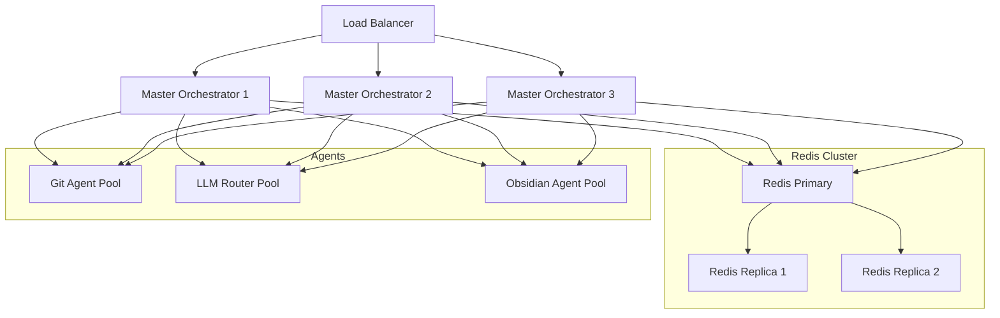

# Scalability Design Specification

## 1. System Architecture



## 2. Component Interactions

### 2.1 Load Balancer
- Implements round-robin distribution across master_orchestrator instances
- Health check endpoint: `/health`
- SSL termination
- Connection draining during deployments
- Sticky sessions based on correlation_id

### 2.2 Master Orchestrator Instances
- Stateless design for horizontal scaling
- Shared configuration via Kubernetes ConfigMaps
- Resource quotas per instance:
  - CPU: 2 cores
  - Memory: 4GB
  - Max concurrent connections: 1000

### 2.3 Redis Cluster
- Primary-replica architecture (1 primary, 2 replicas)
- Data persistence: RDB snapshots every 15 minutes
- Used for:
  - Distributed caching of LLM responses
  - Session state management
  - Agent health status sharing
  - Task queue management

### 2.4 Agent Pools
- Horizontally scalable agent instances
- Independent scaling policies per agent type
- Resource quotas per agent instance:
  - CPU: 1 core
  - Memory: 2GB

## 3. Data Flow Patterns

### 3.1 Request Flow
1. Client request arrives at load balancer
2. Load balancer routes to available master_orchestrator
3. Master_orchestrator:
   - Checks Redis cache for existing response
   - If cache miss, processes request and caches result
   - Updates agent health status in Redis
   - Returns response to client

### 3.2 State Management
- Correlation IDs used for request tracking
- Agent health status shared via Redis
- Session state maintained in Redis
- Circuit breaker state synchronized across instances

## 4. Resource Requirements

### 4.1 Master Orchestrator Pod
```yaml
resources:
  requests:
    cpu: "1"
    memory: "2Gi"
  limits:
    cpu: "2"
    memory: "4Gi"
```

### 4.2 Agent Pod
```yaml
resources:
  requests:
    cpu: "500m"
    memory: "1Gi"
  limits:
    cpu: "1"
    memory: "2Gi"
```

### 4.3 Redis Pod
```yaml
resources:
  requests:
    cpu: "2"
    memory: "4Gi"
  limits:
    cpu: "4"
    memory: "8Gi"
```

## 5. Deployment Strategy

### 5.1 Kubernetes Configuration
- Namespace: phoenix-orch
- Deployment strategy: Rolling update
- Anti-affinity rules for high availability
- Readiness/liveness probes via `/health` endpoint
- Horizontal Pod Autoscaling (HPA) based on CPU/memory metrics

### 5.2 Redis Deployment
- StatefulSet for stable network identities
- Persistent volumes for data storage
- Automated failover configuration
- Regular backup schedule

## 6. Monitoring & Observability

### 6.1 Key Metrics
- Request latency per instance
- Cache hit/miss ratio
- Agent health status
- Resource utilization
- Error rates
- Queue lengths

### 6.2 Prometheus Configuration
```yaml
scrape_configs:
  - job_name: 'master-orchestrator'
    kubernetes_sd_configs:
      - role: pod
    relabel_configs:
      - source_labels: [__meta_kubernetes_pod_label_app]
        regex: master-orchestrator
        action: keep
    metric_relabel_configs:
      - source_labels: [__name__]
        regex: 'orchestrator_.*'
        action: keep
```

### 6.3 Alerts
- Instance CPU/Memory > 80% for 5m
- Error rate > 1% for 5m
- Cache hit ratio < 50% for 15m
- Agent health degraded for 10m
- Redis replication lag > 10s

## 7. Implementation Phases

1. Redis Integration
   - Set up Redis cluster
   - Implement caching layer
   - Add session state management

2. Kubernetes Setup
   - Create namespace and resource quotas
   - Deploy master_orchestrator StatefulSet
   - Configure HPA

3. Load Balancer
   - Deploy and configure ingress
   - Set up SSL termination
   - Configure health checks

4. Monitoring
   - Deploy Prometheus/Grafana
   - Set up alerts
   - Create dashboards

5. Testing
   - Load testing
   - Failover scenarios
   - Performance benchmarking